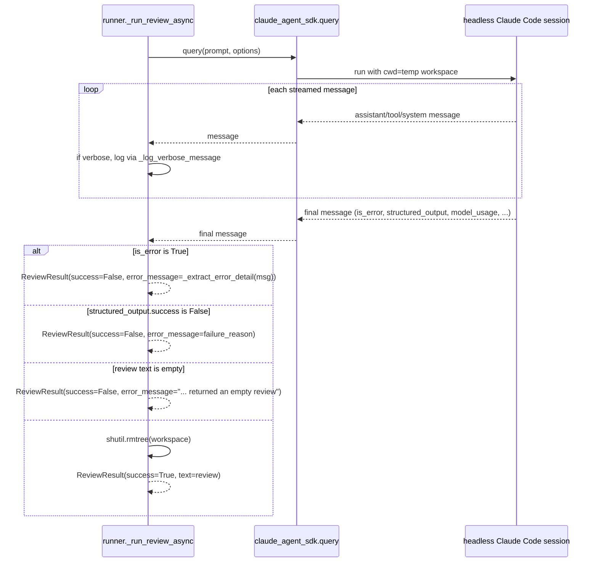

# code-review-cli

`code_review_cli` is a thin wrapper that triggers a **headless** Claude Code session to
review a pull request. It does not review code itself — it validates input, builds a task
prompt, and hands off to a headless session (invoked via the Claude Agent SDK's `query()`)
which checks out the PR itself and dispatches the `voltagent-qa-sec:code-reviewer` subagent
(or, at `hard` level, five subagents plus a judge) to do the actual review.

```bash
python -m code_review_cli.cli --repo <owner/repo> --pr <N> --provider github|codecommit \
  [--model haiku|sonnet|opus] [--level light|standard|hard] [--verbose]
# --model defaults to sonnet (light defaults to haiku when --model omitted); opus only with --model opus
```

Five single-responsibility modules under `src/code_review_cli/`, wired together by
`cli.py` (`main`):

## Validation gate — `validation.py`

`validate_provider`, `validate_pr`, `validate_repo`, `validate_model`, `validate_level`
each raise `ValidationError` (a `ValueError` subclass) on bad input. `cli.py`'s `main`
calls all five inside one `try`/`except ValidationError` block before ever calling
`run_review` — invalid input exits `2` and never reaches Claude Code
(`tests/test_cli.py::test_main_rejects_invalid_repo_without_invoking_claude` and its
siblings assert `run_review` was never called).

- `validate_repo` picks a regex by provider: GitHub accepts `owner/repo` or
  `github.com/owner/repo` (`_GITHUB_REPO_RE`); CodeCommit accepts a single segment with no
  slash (`_CODECOMMIT_REPO_RE`). Both segment patterns forbid a leading `-`, closing off
  values that could be mistaken for a CLI flag by a downstream `gh`/`aws` call.
- `validate_model` maps the case-insensitive aliases `haiku`/`sonnet`/`opus` to concrete
  model ids (`_MODEL_ALIASES`, e.g. `"opus" → "claude-opus-5"`) and passes `None` through
  unchanged — `cli.py` then defaults `None` to `sonnet` (or `haiku` for `level == light`)
  before calling `run_review`, so `opus` is only used when explicitly passed via
  `--model opus`.
- `validate_level` defaults `None` to `"standard"` and otherwise requires membership in
  `VALID_LEVELS = {"light", "standard", "hard"}`.

## Prompt construction — `prompts.py`

`build_prompt(provider, repo, pr, level="standard")` renders `_SHARED_PREAMBLE`, filling
in a provider-specific checkout fragment (`_GITHUB_CHECKOUT` runs `gh repo clone` then
`gh pr checkout {pr}`; `_CODECOMMIT_CHECKOUT` runs `aws codecommit get-pull-request` to
resolve the source commit, then `git clone codecommit://{repo}` and checks that commit
out) and a level-specific dispatch block from `_LEVEL_INSTRUCTIONS`:

| Level | Dispatch instructions | Model default |
|---|---|---|
| `light` | One `voltagent-qa-sec:code-reviewer` subagent, explicitly told to report only high-confidence correctness/security findings and skip style/nit-level ones | `cli.py` defaults `--model` to `haiku` when not given explicitly |
| `standard` | One `voltagent-qa-sec:code-reviewer` subagent, full scope | `cli.py` defaults `--model` to `sonnet` when not given explicitly (`opus` only with `--model opus`) |
| `hard` | Five subagents in sequence (`code-reviewer`, `security-auditor`, `performance-engineer`, `architect-reviewer`, `qa-expert`), each waited on in turn, then a final unnamed judge subagent given all five reports verbatim, instructed to merge duplicates and drop any finding that doesn't survive an adversarial recheck | `cli.py` defaults `--model` to `sonnet` when not given explicitly (`opus` only with `--model opus`) |

`standard` is byte-for-byte pinned by a golden-output test
(`tests/test_prompts.py::test_build_prompt_standard_matches_golden_output`) — the
`--level` feature was added later specifically without changing default behavior for
existing callers (`docs/superpowers/plans/2026-08-19-review-levels.md`, Global
Constraints). The reply contract is always
`{"success": bool, "review": str, "failure_reason": str}` (`_RESULT_SCHEMA`), enforced by
the SDK's `output_format`, regardless of level; `_REVIEW_SOURCE` only changes what counts
as "the review" — the single subagent's report for `light`/`standard`, the judge's merged
report for `hard`.

Before the dispatch step, the prompt instructs the session to check for a `.wiki/`
directory at the repository root and, if present, read `.wiki/index.md` plus whatever
pages it links to that are relevant to the changed files, folding that into the task
description it hands the reviewing subagent(s) — this is the one coupling point with
`wiki-cli.md`. The prompt is explicit that code outranks the wiki: where they disagree,
trust the code and note the discrepancy in the review. It is equally explicit that an
unresolvable repo or PR must **not** be silently swapped for a different one — the session
stops and returns the failure JSON shape instead.

## Execution — `runner.py`

`run_review(provider, repo, pr, verbose=False, model=None, level="standard")` wraps
`asyncio.run(_run_review_async(...))` and never raises — even an `asyncio.run` failure
(e.g. "cannot be called from a running event loop") is caught and returned as a failed
`ReviewResult`.

`_run_review_async`:
1. Initializes `last_message = None` before the `try` block, so it is available to the
   `except` handler even if the SDK raises mid-stream.
2. Creates a fresh temp directory (`tempfile.mkdtemp(prefix="code-review-")`) as the
   session's `cwd`.
3. Calls `query(prompt=build_prompt(...), options=ClaudeAgentOptions(...))` and iterates
   the async message stream, keeping only the last message that has an `is_error`
   attribute (the SDK's result message) in `last_message`.
4. If `verbose`, every message is also passed to `_log_verbose_message`, which
   duck-types the message shape via `hasattr()` rather than importing SDK message classes
   — printing `[assistant]`/`[tool call]`/`[thinking]`/`[user]`/`[tool result]`/
   `[system:*]` lines to stderr as appropriate. This is why the test suite fakes SDK
   messages with `types.SimpleNamespace` instead of importing real SDK dataclasses: an SDK
   version bump only requires changes in this one function.
5. On a normal (non-raising) stream, `_finalize_review_result(last_message)` applies the
   `is_error` / `structured_output.success` / empty-review gates described below.
6. If `query()` raises, the `except Exception as exc:` handler works around a known SDK
   quirk (see "Exception handling and rate-limit detection" below) instead of just
   stringifying the exception.

`ClaudeAgentOptions` is built with `permission_mode="bypassPermissions"`, `max_turns=150`,
`setting_sources=["user", "project"]`, and `output_format` forcing `_RESULT_SCHEMA`.
`setting_sources` excludes `"local"` scope deliberately: dispatching
`voltagent-qa-sec:code-reviewer` requires the SDK to discover that plugin-provided
subagent, which needs `"user"`/`"project"` settings scope, while excluding `"local"`
isolates the run from the operator's personal permission/hook configuration.


*The runner's message loop and success/failure branching — the same shape (minus the temp
workspace) drives `wiki-cli.md`'s runner.*

### Error extraction and rate-limit detection

`_finalize_review_result(message)` — the success/failure branching in the diagram above —
delegates its `is_error` and metrics branches to two small helpers shared verbatim (aside
from the return type) with `wiki-cli.md`'s runner:

- **`_extract_error_detail(message) -> str`** tries, in order: `message.result` (if a
  non-empty string) → `message.errors` (joined) → `message.subtype` (if set and not
  `"success"`) → `message.api_error_status` mapped to a specific message (`429` →
  `_MSG_RATE_LIMIT`, `529` → `_MSG_OVERLOADED`, anything else → a generic
  `f"API error {api_error_status}: ... (subtype={subtype_str}) ..."` string) → the
  constant `_FALLBACK_ERROR` ("Claude Code reported an error") if nothing else matched.
- **`_extract_metrics(message) -> dict`** is the same `model_usage`-summing logic
  described below, factored out so both the normal-completion path and the exception path
  (next paragraph) can attach metrics to a failure result.

Separately, `_run_review_async`'s `except Exception as exc:` handler works around a
specific SDK quirk: some failures surface as a raised exception whose string contains the
literal text `_SDK_SUCCESS_SENTINEL` ("Claude Code returned an error result: success")
rather than as a normal result message. When that sentinel is **absent** from the
exception string, the handler falls back to `last_message` if it was captured (using
`_extract_error_detail`/`_extract_metrics`) or otherwise returns the raw exception text
verbatim. When the sentinel **is present**, it treats the exception as a masked SDK-side
error and tries to recover a specific reason from `last_message` via
`_extract_error_detail`, falling back to `_SDK_GENERIC_FALLBACK` ("Claude Code returned an
error — check `claude status` for usage limit or try again later") when `last_message` is
absent or `_extract_error_detail` couldn't find anything more specific than
`_FALLBACK_ERROR`. This is how a `429` or `529` response from the Anthropic API ends up
surfacing as `_MSG_RATE_LIMIT`/`_MSG_OVERLOADED` instead of an opaque SDK exception string.

No test in `tests/test_runner.py` currently exercises this sentinel/`api_error_status`
path (confirmed by grepping the test file for `_SDK_SUCCESS_SENTINEL`,
`api_error_status`, `_MSG_RATE_LIMIT`, and `_MSG_OVERLOADED` — no matches); the existing
tests cover only the pre-existing `is_error`/`structured_output`/empty-message paths. A
change to this logic currently has no regression coverage.

Two invariants this diagram makes explicit, both called out as real production bugs fixed
during development:

- **`is_error=False` does not mean the review succeeded.** A session can complete
  normally while the underlying task failed (bad checkout, unresolvable repo). Real
  success/failure comes from `structured_output.success` — checked as a second, independent
  gate after `is_error` — not from `is_error` alone.
- **Token/cost metrics require summing across `model_usage`** (a dict keyed by model name,
  since a run can span more than one model — the orchestrator plus a dispatched subagent).
  Both `inputTokens`/`outputTokens` *and*
  `cacheReadInputTokens`/`cacheCreationInputTokens` are summed; omitting the cache fields
  previously produced a cost/token mismatch in the metrics line, since cache reads/writes
  dominate cost in multi-turn sessions.

The temp workspace is deleted on success (`shutil.rmtree`, with a caught-and-logged
warning if that fails — `test_run_review_still_succeeds_if_cleanup_fails`) and
deliberately left in place on any failure path, including a task-level failure reported
through `structured_output`, for post-mortem debugging
(`test_run_review_keeps_workspace_on_failure`,
`test_run_review_keeps_workspace_when_task_level_failure`).

## CLI entrypoint — `cli.py`

`main(argv)` parses flags with `argparse`, runs the five validators, and resolves
`model` to `"claude-haiku-4-5"` for `level == "light"` with no explicit `--model`,
otherwise to `"claude-sonnet-5"` when no `--model` is given (`opus` only with
`--model opus`), before calling `run_review`. `_print_metrics` always writes
one `[metrics] level=... cost=$... duration=...ms turns=... input_tokens=... ...` line to
**stderr**, regardless of success or failure. On success, `result.text` (the review) goes
to **stdout** and `main` returns `0`; on failure, `result.error_message` goes to stderr and
`main` returns `result.exit_code()` (`1`). stdout's contract is strictly "review text only"
— verbose SDK logging and the metrics line both go to stderr so stdout stays pipeable.

## Result — `result.py`

`ReviewResult` is a plain dataclass: `success`, `text`, `error_message`, and the run
metrics threaded through from `runner.py` (`cost_usd`, `duration_ms`, `num_turns`,
`input_tokens`, `output_tokens`, `cache_read_tokens`, `cache_creation_tokens`).
`exit_code()` maps `success` to `0`/`1`.

## Where to make a change

| Change | Start here | Validate with |
|---|---|---|
| New/changed CLI flag or validation rule | `validation.py`, then `cli.py`'s `build_arg_parser`/`main` | `pytest tests/test_validation.py tests/test_cli.py -v` |
| New review level or dispatch behavior | `prompts.py`'s `_LEVEL_INSTRUCTIONS`/`_REVIEW_SOURCE` — remember the `standard` golden-snapshot test | `pytest tests/test_prompts.py -v` |
| SDK message handling, metrics aggregation, workspace lifecycle | `runner.py` — fake SDK messages as `types.SimpleNamespace`, not real SDK classes | `pytest tests/test_runner.py -v` |
| Result shape or exit codes | `result.py` | `pytest tests/test_result.py -v` |

Full suite: `pytest tests/ -v` (excludes nothing package-specific — `wiki-cli.md` shares
the same `tests/` directory, prefixed `test_wiki_*`).

## Sources

- `src/code_review_cli/validation.py` (`validate_provider`, `validate_pr`, `validate_repo`, `validate_model`, `validate_level`)
- `src/code_review_cli/prompts.py` (`build_prompt`, `_LEVEL_INSTRUCTIONS`, `_RESULT_SCHEMA`)
- `src/code_review_cli/runner.py` (`run_review`, `_run_review_async`, `_finalize_review_result`, `_extract_error_detail`, `_extract_metrics`)
- `src/code_review_cli/cli.py` (`main`, `_print_metrics`)
- `src/code_review_cli/result.py` (`ReviewResult`, `exit_code`)
- `tests/test_cli.py`
- `tests/test_prompts.py`
- `tests/test_runner.py`
